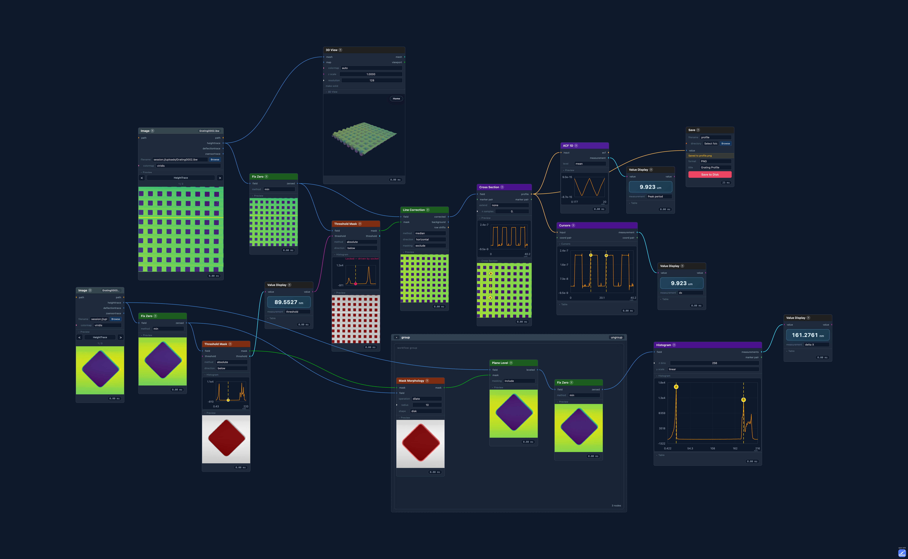

[](https://github.com/VIPQualityPost/tono/actions/workflows/build.yml) [](https://github.com/VIPQualityPost/tono/actions/workflows/tests.yml)

# tono


tono is a node-based SPM image processing and analysis tool. The main focus is on topographical measurements.

It is heavily inspired by [Gwyddion](https://gwyddion.net/), one of my favorite scientific FOSS programs on the web.



## Quick start
Install a local binary from the Releases section, or run locally: 

```bash
# Installation
python -m venv .venv && source .venv/bin/activate   # Windows: .venv\Scripts\activate
pip install -e ".[dev]"
npm install

# Running the servers
npm run backend   # terminal 1 — Python server at http://127.0.0.1:8188
npm run dev       # terminal 2 — Vite dev server, open the URL it prints
```

## Docs

- [Building](docs/building.md) — setup, dev mode, web deployment, and native desktop builds for macOS, Linux, and Windows
- [Plugins](docs/plugins.md) — writing and uploading custom node plugins
- [Testing](docs/testing.md) — running tests and writing new ones

## Project layout

```text
tono/
  backend/         Python server, execution engine, nodes
  frontend/        React/Vite app
  plugins/         User plugin files (.py)
  tests/           Python tests
  docs/            Documentation
  desktop.py       Desktop launcher
  scripts/         Build scripts (macOS, Linux, Windows)
```
